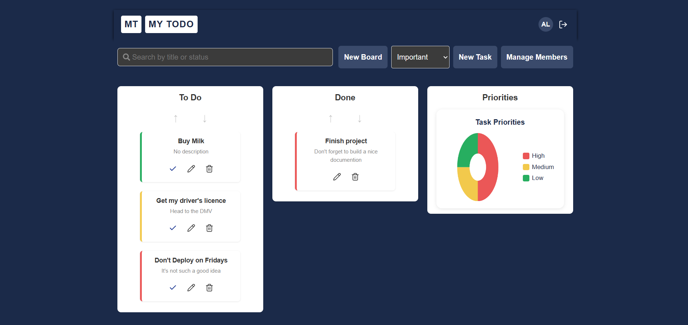

# 📝 Task Board App (Frontend)


---

## 🎬 Demo



---

## 🧩 Descrição

O **Task Board App** é a interface frontend que se conecta à **API Todo** para gerenciamento de boards e tasks.  
Permite criar boards (para owners), adicionar tasks, gerenciar tarefas e colaborar com administradores.

⚠️ **Atenção:** Quando um usuário comum loga pela primeira vez, ele verá um aviso informando que um administrador precisa atribuir um board a ele antes de poder acessar ou criar tasks. Assim, o user comum deverá se deslogar, e um adminstrador deve entrar em sua conta e atribuir um board a esse usuário.

---

## ⚙️ Tecnologias

- **React 19**
- **TypeScript**
- **Styled-Components**
- **Vite**
- **React ChartJS 2** (para gráficos de tasks)
- **Lucide React & React Icons** (ícones)

---

## 📂 Estrutura do Projeto

```
interface_todo/
├── src/
│   ├── components/       # Componentes reutilizáveis
│   ├── contexts/         # Contextos de estado (Auth, Boards, Tasks)
│   ├── pages/            # Páginas principais (BoardPage, Login, Register)
│   ├── services/         # Conexão com a API e funções de fetch
│   ├── styles/           # Styled-components globais e específicos
│   ├── App.tsx
│   ├── Main.tsx
│   ├── App.css
│   └── Index.css
├── package.json
├── tsconfig.json
└── README.md
```

---

## 🚀 Como Rodar o Projeto

### 1️⃣ Clonar o repositório

```bash
git clone https://github.com/seu-usuario/interface_todo.git
cd interface_todo
```

### 2️⃣ Instalar dependências

```bash
npm install
```

### 3️⃣ Configurar conexão com a API

Certifique-se que a **API Todo** esteja rodando (http://localhost:3333).

### 4️⃣ Executar a aplicação

```bash
npm run dev
```

A aplicação estará disponível em:

```
http://localhost:5173
```

---

## 💡 Funcionalidades

- Login e registro de usuários (Owner e Admin)
- Criação e gerenciamento de boards (apenas Owners)
- Criação, edição e exclusão de tasks
- Controle de acesso baseado em roles
- Dashboard com contagem de tasks e gráficos (opcional)
- Pesquisa de tasks por título ou status
- Responsivo para desktop e mobile

---

## 🛠️ Scripts Úteis

| Comando           | Descrição                              |
| ----------------- | -------------------------------------- |
| `npm run dev`     | Inicia o servidor de desenvolvimento   |
| `npm run build`   | Cria o build de produção               |
| `npm run preview` | Visualiza o build final                |
| `npm run lint`    | Executa o ESLint para verificar código |

---

## 📜 Licença

Este projeto é de uso livre para fins de estudo e demonstração

**Autor:** Alexandre Gaia  
**LinkedIn:** linkedin.com/in/alexandre-gaia  
**E-mail:** alexandregaia.dev@gmail.com
